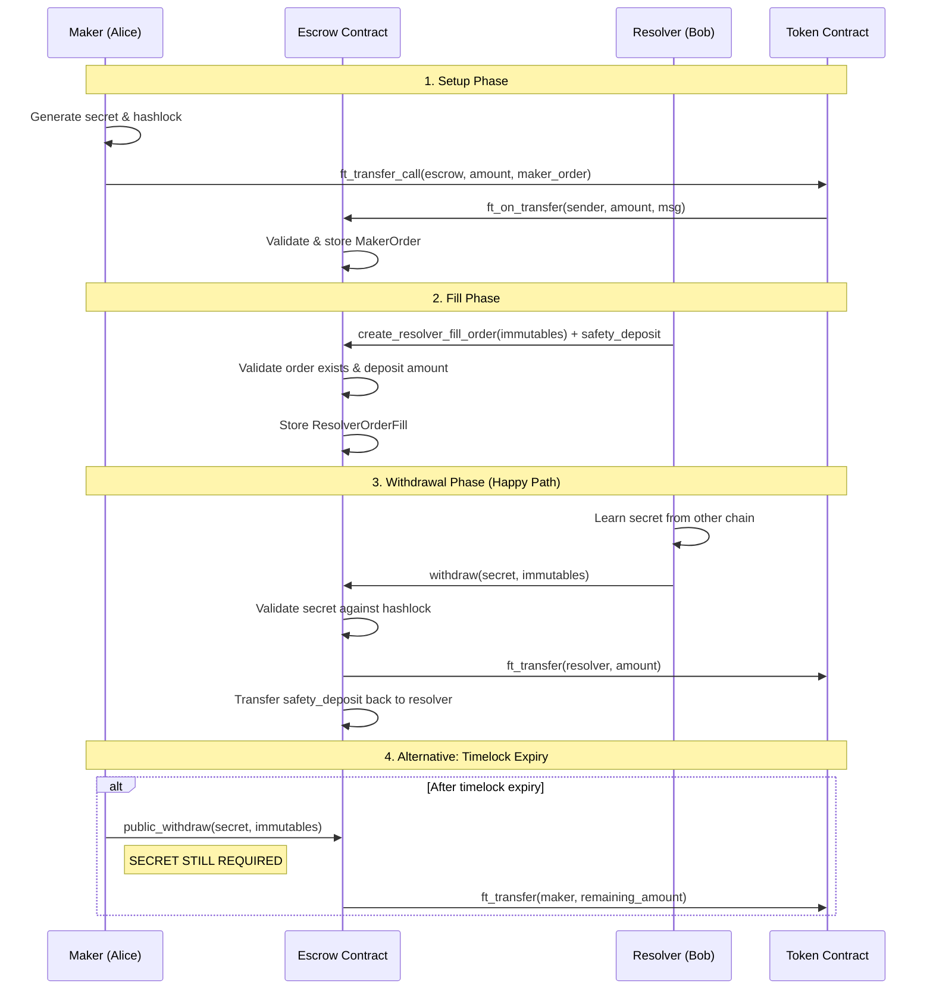

# NEAR Escrow Contract with Hash Time Locked Contracts (HTLC)

A sophisticated atomic swap escrow system built on NEAR Protocol, enabling secure cross-chain token exchanges using Hash Time Locked Contracts (HTLC).

## 🚀 Features

- **Atomic Swaps**: Secure peer-to-peer token exchanges without intermediaries
- **Hash Time Locked Contracts (HTLC)**: Time-bound transactions with cryptographic guarantees
- **Partial Fill Support**: Orders can be filled in multiple parts using Merkle trees
- **Safety Deposits**: Resolver deposits ensure commitment to fulfill orders
- **Multi-Chain Support**: Designed for cross-chain atomic swaps
- **Timelock Protection**: Multiple timelock layers for withdrawal and cancellation

## 📋 Table of Contents

- [Architecture Overview](#architecture-overview)
- [HTLC Flow Diagram](#htlc-flow-diagram)
- [Core Components](#core-components)
- [Usage Examples](#usage-examples)
- [Time Lock Mechanics](#time-lock-mechanics)
- [Testing](#testing)
- [Deployment](#deployment)

## 🏗️ Architecture Overview

```
┌─────────────────┐    ┌──────────────────┐    ┌─────────────────┐
│   Maker (Alice) │    │ Escrow Contract  │    │Resolver (Bob)   │
│                 │    │                  │    │                 │
│ 1. Creates Order│───▶│ 2. Stores Order  │◄───│ 3. Fills Order  │
│ 4. Waits for    │    │ 5. Validates     │    │ 6. Provides     │
│    Secret       │◄───│    Fill & Locks  │───▶│    Deposit      │
│ 7. Claims Tokens│    │    Tokens        │    │ 8. Gets Secret  │
└─────────────────┘    └──────────────────┘    └─────────────────┘
```

## 🔐 HTLC Flow Diagram



## 🧩 Core Components

### MakerOrder
```rust
pub struct MakerOrder {
    root_hash: String,              // hashlock for single, merkle_root for multi fill
    token: AccountId,               // token used by maker to make exchange
    total_amount: NearToken,        // total tokens maker is putting
    parts: u16,                     // parts the order is divided in (default 1)
    filled_amount: NearToken,       // taker placed amount
    withdrawn_amount: NearToken,    // withdrawn amount
    maker: AccountId,               // maker account
    expiration: u64                 // timestamp beyond which user can run self withdrawal
}
```

### ResolverOrderFill
```rust
pub struct ResolverOrderFill {
    immutables: Immutables          // Contains all swap parameters
}
```

### Immutables (from shared_lib)
Contains swap parameters that cannot be changed once set:
- Order root hash
- Making token and amount
- Taker and maker accounts
- Hashlock for secret verification
- Safety deposit amount
- Timelock constraints

## 💡 Usage Examples

### 1. Creating a Maker Order (via FT Transfer)

```javascript
// JavaScript client
const makerOrder = {
    root_hash: "sha256_hash_of_secret",
    token: "usdc.testnet",
    total_amount: "1000000000000000000000000", // 1 NEAR in yoctoNEAR
    parts: 1,
    filled_amount: "0",
    withdrawn_amount: "0",
    maker: "alice.testnet",
    expiration: Date.now() + 86400000 // 24 hours
};

// Serialize and transfer via FT contract
const msg = hex.encode(borsh.serialize(makerOrderSchema, makerOrder));
await ftContract.ft_transfer_call({
    receiver_id: "escrow.testnet",
    amount: "1000000000000000000000000",
    msg: msg
});
```

### 2. Filling an Order (Resolver)

```javascript
const immutables = {
    order_root_hash: "maker_order_hash",
    making_token: "usdc.testnet",
    making_amount: "1000000000000000000000000",
    taker: "bob.testnet",
    maker: "alice.testnet",
    hashlock: "sha256_hash_of_secret",
    src_safty_deposit: "1000000000000000000000000", // 1 NEAR
    timelock: {
        src_withdrawal: Date.now() + 3600000,        // 1 hour
        src_public_withdrawal: Date.now() + 7200000, // 2 hours
        src_cancellation: Date.now() + 14400000,     // 4 hours
        src_public_cancellation: Date.now() + 18000000 // 5 hours
    }
};

await escrowContract.create_resolver_fill_order({
    immutables: immutables,
    idx: null,
    merkle_proof: null
}, "1000000000000000000000000"); // Attach safety deposit
```

### 3. Withdrawing with Secret

```javascript
await escrowContract.withdraw({
    secret: "revealed_secret_from_other_chain",
    immutables: immutables
});
```

### 4. Public Withdrawal (Still Requires Secret!)

```javascript
// Even after timelock expiry, secret is STILL required
await escrowContract.public_withdraw({
    secret: "revealed_secret_from_other_chain",
    immutables: immutables
});
```

## ⏰ Time Lock Mechanics

The contract implements a sophisticated timelock system with four distinct phases:

```
Timeline: ────────────────────────────────────────▶
          T0    T1         T2          T3        T4
          │     │          │           │         │
          │     │ Private  │  Public   │ Private │ Public
          │     │Withdraw  │ Withdraw  │ Cancel  │ Cancel
          │     │(Secret)  │(+Secret)  │(Taker)  │(Anyone)
          │     │          │           │         │
     Order│     └─Resolver can withdraw with secret
     Created     └─────────Maker can withdraw WITH SECRET
                           └─────────Taker can cancel order
                                     └─────────Anyone can cancel
```

### Timelock Phases:

1. **Private Withdrawal Window** (`src_withdrawal`): Only resolver can withdraw with secret
2. **Public Withdrawal Window** (`src_public_withdrawal`): Maker can withdraw **WITH SECRET**
3. **Private Cancellation Window** (`src_cancellation`): Only taker can cancel
4. **Public Cancellation Window** (`src_public_cancellation`): Anyone can cancel

**Important**: All withdrawal functions require the secret - the "public" withdrawal only means the timelock has expired, not that the secret is optional!

## 🔍 Partial Fill Support

For orders with `parts > 1`, the contract supports partial fills using Merkle trees with **parts + 1** secrets:

```
Total Order: 100 tokens, 4 parts (25 tokens each) = 5 secrets (S0-S4)

Merkle Tree:
              Root
           /        \
       Hash1          Hash2
      /     \        /     \
   Hash3   Hash4  Hash5   Hash6
   /  \     /  \    /  \    |
  S0  S1   S2  S3  S4   -   -

Parts:  [25] [25] [25] [25]
Secrets: S0   S1   S2   S3/S4

- S0: Unlocks first 25 tokens
- S1: Unlocks second 25 tokens  
- S2: Unlocks third 25 tokens
- S3: Can unlock partial amount from last 25 tokens
- S4: MUST be used to complete the final part entirely
```

### Partial Fill Logic:

1. **First 3 parts (75 tokens)**: Use secrets S0, S1, S2 respectively
2. **Last part (25 tokens)**:
   - **Partial fill** (e.g., 15 tokens): Use S3
   - **Complete final part** (remaining 10 tokens): **MUST use S4**

### Partial Fill Examples:

```javascript
// Fill first part (25 tokens) - Use S0
await escrowContract.create_resolver_fill_order({
    immutables: immutables,
    idx: 0, // Using secret S0
    merkle_proof: ["hash_s1", "hash4", "hash2"] // Proof for S0
});

// Fill partial amount from last part (15 out of 25) - Use S3
await escrowContract.create_resolver_fill_order({
    immutables: immutables,
    idx: 3, // Using secret S3
    merkle_proof: ["hash_s4", "hash6", "hash2"] // Proof for S3
});

// Complete the order (remaining 10 tokens) - MUST use S4
await escrowContract.create_resolver_fill_order({
    immutables: immutables,
    idx: 4, // Using secret S4 (the completion secret)
    merkle_proof: ["hash_s3", "hash6", "hash2"] // Proof for S4
});
```

**Key Rule**: Whoever completes the order entirely **must use the extra secret (S4)** for the final completion.

## 🧪 Testing

The contract includes comprehensive tests covering:

- Happy path scenarios
- Error conditions and edge cases
- Partial fill mechanics with completion secrets
- Timelock validations
- Mathematical calculations

```bash
# Run tests
cargo test

# Run specific test
cargo test test_ft_on_transfer_success

# Run with output
cargo test -- --nocapture
```

### Key Test Scenarios:

- ✅ Valid maker order creation
- ✅ Resolver fill order with correct deposit
- ✅ Withdrawal with valid secret (private & public)
- ✅ Partial fill calculations with completion logic
- ✅ Completion secret validation
- ❌ Invalid deposits
- ❌ Expired orders
- ❌ Unauthorized withdrawals
- ❌ Invalid secrets

## 🚀 Deployment

### Prerequisites:
```bash
# Install NEAR CLI
npm install -g near-cli

# Install Rust and wasm32 target
rustup target add wasm32-unknown-unknown
```

### Build and Deploy:
```bash
# Build contract
cargo build --target wasm32-unknown-unknown --release

# Deploy to testnet
near deploy --wasmFile target/wasm32-unknown-unknown/release/escrow_src.wasm --accountId your-contract.testnet

# Initialize (if needed)
near call your-contract.testnet new {} --accountId your-account.testnet
```

### Environment Setup:
```bash
# Set network
export NEAR_ENV=testnet

# Create accounts for testing
near create-account alice.testnet --useFaucet
near create-account bob.testnet --useFaucet
```

## 🔐 Security Considerations

1. **Secret Management**: Secrets should be generated securely and only revealed when safe
2. **Completion Secret**: The extra secret (S_parts+1) must be protected until final completion
3. **Timelock Ordering**: Ensure timelock values are properly ordered (withdrawal < cancellation)
4. **Safety Deposits**: Resolver deposits ensure commitment but should be reasonable
5. **Merkle Proofs**: Validate all merkle proofs for partial fills
6. **Overflow Protection**: All mathematical operations use checked arithmetic

## 📚 API Reference

### Main Functions:

- `ft_on_transfer(sender, amount, msg)` - Called by FT contract to create maker orders
- `create_resolver_fill_order(immutables, idx?, merkle_proof?)` - Resolver fills order
- `withdraw(secret, immutables)` - Withdraw with secret revelation
- `public_withdraw(secret, immutables)` - Withdraw after timelock **WITH SECRET**
- `cancel(immutables)` - Cancel order (time-locked)
- `public_cancel(immutables)` - Public cancellation after timeout

### View Functions:

- `check_order(immutables) -> bool` - Check if order exists

## 🤝 Contributing

1. Fork the repository
2. Create a feature branch
3. Add tests for new functionality
4. Ensure all tests pass
5. Submit a pull request

## 📄 License

This project is licensed under the MIT License.

## 🆘 Support

For questions or issues:
- Create an issue on GitHub
- Join our Discord community
- Check the NEAR Protocol documentation

---

**Built with ❤️ on NEAR Protocol**
